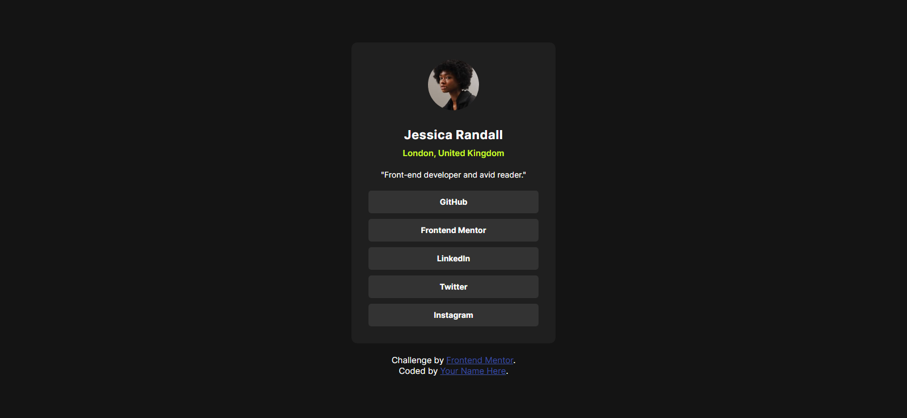
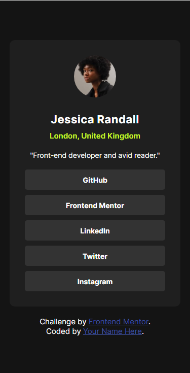

# Frontend Mentor - Social links profile solution

This is a solution to the [Social links profile challenge on Frontend Mentor](https://www.frontendmentor.io/challenges/social-links-profile-UG32l9m6dQ). Frontend Mentor challenges help you improve your coding skills by building realistic projects. 

## Table of contents

- [Overview](#overview)
  - [The challenge](#the-challenge)
  - [Screenshot](#screenshot)
  - [Links](#links)
- [My process](#my-process)
  - [Built with](#built-with)
  - [What I learned](#what-i-learned)
  - [Continued development](#continued-development)
- [Author](#author)

## Overview

### The challenge

Users should be able to:

- See hover and focus states for all interactive elements on the page

### Screenshot





### Links

- Solution URL: [Click here!](https://your-solution-url.com)
- Live Site URL: [Click here!](https://your-live-site-url.com)

## My process

### Built with

- Semantic HTML5 markup
- CSS custom properties
- Flexbox
- CSS Grid

### What I learned
The only thing I learned is to replace

```css
div {
  display: flex;
  align-items: center;
  justify-content: center;
}
```

```css
div {
  display: grid;
  place-content: center;
}
```

### Continued development

I'll keep on doing newbie level challenges until I finish them all (Even though I'm not newbie). Then I'll move to harder challanges.

## Author

- Frontend Mentor - [@CodeItOfficial](https://www.frontendmentor.io/profile/CodeItOfficial)
